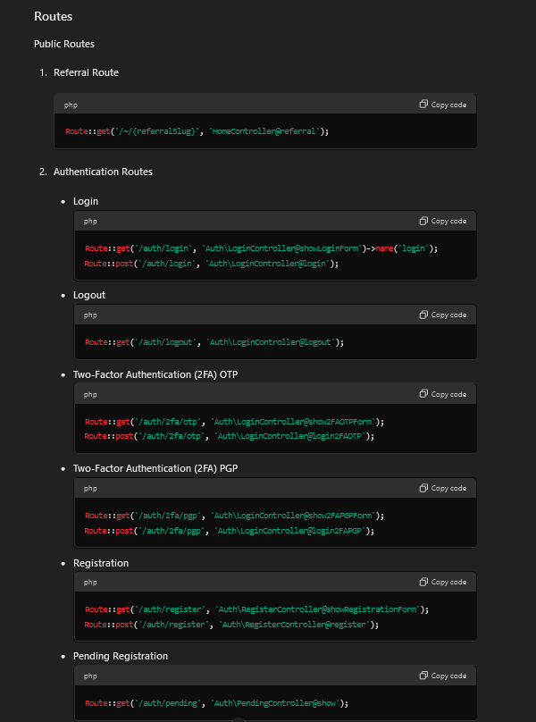

<p align="center"></p>

<p align="center">
<a href="https://travis-ci.org/laravel/framework"></a>
<a href="https://packagist.org/packages/laravel/framework"></a>
<a href="https://packagist.org/packages/laravel/framework"></a>
<a href="https://packagist.org/packages/laravel/framework"></a>
</p>

## About Laravel

Laravel is a web application framework with expressive, elegant syntax. We believe development must be an enjoyable and creative experience to be truly fulfilling. Laravel attempts to take the pain out of development by easing common tasks used in the majority of web projects, such as:

- [Simple, fast routing engine](https://laravel.com/docs/routing).
- [Powerful dependency injection container](https://laravel.com/docs/container).
- Multiple back-ends for [session](https://laravel.com/docs/session) and [cache](https://laravel.com/docs/cache) storage.
- Expressive, intuitive [database ORM](https://laravel.com/docs/eloquent).
- Database agnostic [schema migrations](https://laravel.com/docs/migrations).
- [Robust background job processing](https://laravel.com/docs/queues).
- [Real-time event broadcasting](https://laravel.com/docs/broadcasting).

Laravel is accessible, yet powerful, providing tools needed for large, robust applications. A superb combination of simplicity, elegance, and innovation gives you tools you need to build any application with which you are tasked.

## Learning Laravel

Laravel has the most extensive and thorough documentation and video tutorial library of any modern web application framework. The [Laravel documentation](https://laravel.com/docs) is thorough, complete, and makes it a breeze to get started learning the framework.

If you're not in the mood to read, [Laracasts](https://laracasts.com) contains over 900 video tutorials on a range of topics including Laravel, modern PHP, unit testing, JavaScript, and more. Boost the skill level of yourself and your entire team by digging into our comprehensive video library.

## Laravel Sponsors

We would like to extend our thanks to the following sponsors for helping fund ongoing Laravel development. If you are interested in becoming a sponsor, please visit the Laravel [Patreon page](http://patreon.com/taylorotwell):

- **[Vehikl](http://vehikl.com)**
- **[Tighten Co.](https://tighten.co)**
- **[British Software Development](https://www.britishsoftware.co)**
- **[Styde](https://styde.net)**
- [Fragrantica](https://www.fragrantica.com)
- [SOFTonSOFA](https://softonsofa.com/)

## Contributing

Thank you for considering contributing to the Laravel framework! The contribution guide can be found in the [Laravel documentation](http://laravel.com/docs/contributions).

## MM Catalog

MM Catalog is a project designed to manage and catalog various multimedia items. This project utilizes a combination of PHP and Composer to handle dependencies and project structure. It includes a variety of tools and libraries to facilitate the creation, management, and maintenance of multimedia catalogs.

## Table of Contents

- [Introduction](#introduction)
- [Features](#features)
- [Technology Stack](#technology-stack)
- [Getting Started](#getting-started)
  - [Prerequisites](#prerequisites)
  - [Installation](#installation)
  - [Configuration](#configuration)
- [Database Schema](#database-schema)
  - [Tables](#tables)
- [Usage](#usage)
- [Development](#development)
  - [Directory Structure](#directory-structure)
  - [Running Tests](#running-tests)
- [Contributing](#contributing)
- [License](#license)
- [Acknowledgements](#acknowledgements)

## Introduction

MM Catalog is a multimedia catalog management project. It provides functionalities for organizing and maintaining various multimedia items. The main objective is to simplify the management of multimedia collections.

## Features

- **Catalog Management**: Manage and organize multimedia items.
- **Search Functionality**: Easily search through multimedia items.
- **User Management**: Handle user roles and permissions.

## Technology Stack

- **Backend**: PHP, Laravel
- **Frontend**: Blade Templates, HTML, CSS, JavaScript
- **Database**: MySQL
- **Other**: Composer for dependency management

## Getting Started

### Prerequisites

Before you begin, ensure you have met the following requirements:

- PHP version 7.3 or higher
- MySQL installed
- Composer installed

### Installation

1. Clone the repository.
2. Run `composer install` to install dependencies.
3. Copy `.env.example` to `.env` and configure your environment settings.
4. Run `php artisan migrate` to set up the database.
5. Start the development server using `php artisan serve`.

## Project Structure

The project is organized into the following key directories and files:

### Root Directory

- **composer.json**: Defines the project dependencies and metadata.
- **composer.lock**: Locks the dependencies to specific versions.
- **index.php**: Entry point for the web application.
- **.env.example**: Example environment configuration file.
- **.gitignore**: Specifies files to be ignored by Git.

### /app

Contains the core application code, including models, controllers, and views.

- **/Models**: Defines the data models used in the application.
- **/Controllers**: Contains the controllers that handle user input and interaction.
- **/Views**: Stores the views (templates) that are rendered to the user.

### /config

Holds configuration files for different environments and settings.

- **/app.php**: Application-specific configuration.
- **/database.php**: Database connection settings.

### /public

Publicly accessible directory that serves as the web root.

- **/assets**: Contains static assets like CSS, JavaScript, and images.
- **/index.php**: Main entry script for web requests.

### /vendor

Managed by Composer, contains third-party libraries and dependencies.

- **/composer**: Composer's internal files.
- **/doctrine**: Libraries from the Doctrine project.
- **/psr**: PSR standards implementations.

### /resources

Contains resource files such as language files and views.

- **/views**: Blade templates for rendering HTML pages.
- **/lang**: Localization files for different languages.

### /tests

Includes automated tests for the application.

- **/Feature**: Tests for application features.
- **/Unit**: Unit tests for individual components.

## Database Schema

### Tables

- **users**: Stores user information.
- **media_items**: Stores information about multimedia items.
- **categories**: Stores categories for organizing media items.

## Usage

To use the MM Catalog application, follow these steps:

1. Add multimedia items through the admin interface.
2. Organize items into categories.
3. Search and manage items using the provided tools.

# Features included




## Development

### Directory Structure

The project follows the standard Laravel directory structure, making it easy to navigate and maintain.

### Running Tests

To run tests, use the following command:

```bash
php artisan test
```bash
